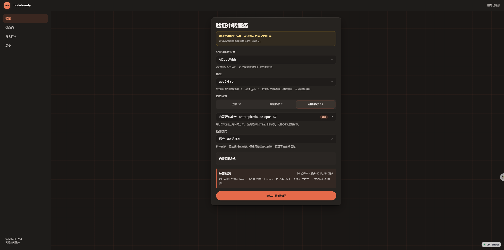
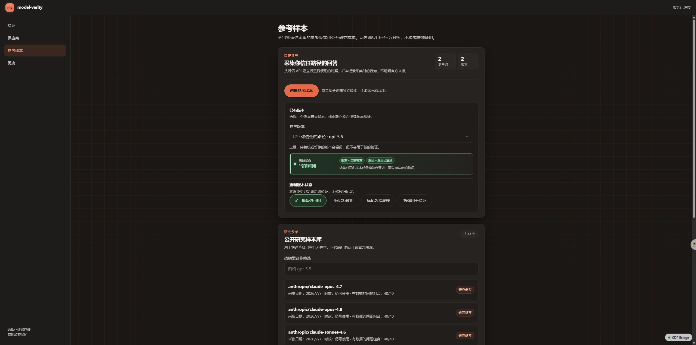
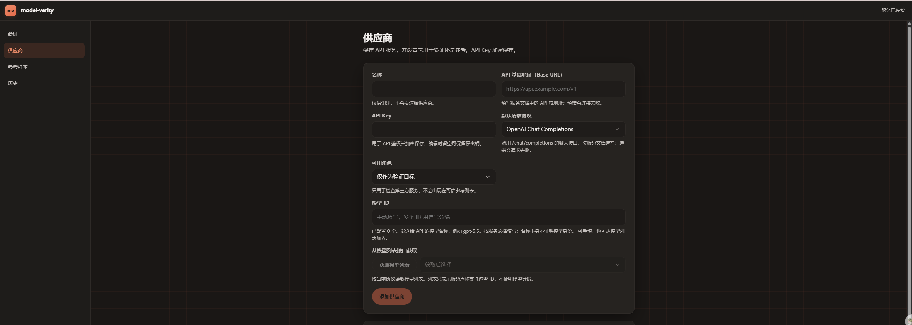
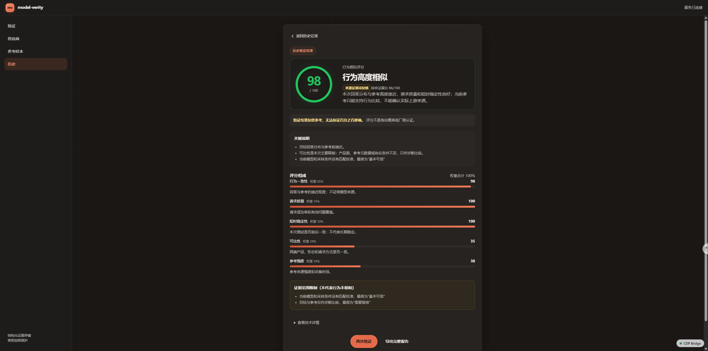

# model-verity

> Verify third-party AI service claims through behavioral fingerprinting.

model-verity 是一个验证第三方 AI 服务声明的 CLI + Web 工具：对目标服务执行固定 challenge，用 PAMELA 单 token 输出分布与版本化参考样本比较，输出 0–100 综合可信评分。评分不是模型为真的概率、厂商认证、密码学来源证明或未来持续保证。

[](LICENSE)
[](package.json)
[](https://doi.org/10.5281/zenodo.21278557)

- 源码仓库：<https://github.com/JESVN/model-verity>（Issues / PR 请前往该仓库）
- 数据面：`service-claims@3.0.0`；评分规则：`pamela-scorecard@3.1.0`。
- 内置研究参考：33 个主流厂商当前代模型（claude、openai、gemini、deepseek、kimi、qwen、glm、grok），基于 Zenodo `10.5281/zenodo.21278557`（CC BY 4.0）。
- 界面与文档以中文为主；`AGENTS.md` 是项目维护规范与证据边界，随仓库公开。

系统以 PAMELA 行为分布为核心，生成 0–100 评分：

1. 行为一致性：55%；
2. 请求质量：15%；
3. 短时稳定性：10%；
4. 可比性：10%；
5. 参考强度：10%。

常规场景显示五维加权的综合可信评分。若行为高度相似但仅受 P3/研究参考来源范围限制，主数字改为行为维度的“行为相似评分”，综合证据分继续作为次级审计值，并单独显示“来源证据待复核”。两项评分都不是模型为真的概率、厂商认证、密码学来源证明或未来持续保证。P3、旧 L3 参考、低成功率、低覆盖或行为混合仍限制最终等级；返回 JSON 中的 `model` 字段只作为弱信号。

## 示例界面

验证页面：选择供应商、模型与参考来源，运行后展示行为相似评分、来源证据等级与五维证据详情。



参考样本：内置研究参考（33 个主流厂商模型）与自建参考版本目录、时效与质量状态。



供应商：管理连接协议、地址与加密保存的 Key（仅显示掩码，不输出明文）。



历史验证记录：已完成运行的结论、评分、导出（JSON/Markdown/CSV）与删除入口。



## 生产部署

```text
https://modelverity.example/
```

生产入口使用 HTTPS 和 Basic Auth；未认证请求返回 401，认证通过后可打开界面并调用 API。Basic Auth 由反向代理管理，凭据不进入本项目。生产业务数据已按 V3 fresh start 要求重置：保留供应商配置和加密密钥，验证、观察、证据、历史、用户参考、校准、预算、分享和设置数据从空状态开始。当前 UI/API 不兼容或展示重置前运行。审计见 `docs/V3生产数据重置-20260729.md`。

当前导航只保留：

```text
验证
供应商
参考样本
历史
```

原“设置”页没有可操作选项，已从生产界面移除。密钥、临时凭据、结构化证据和历史删除说明放在对应工作流附近。

验证页首次加载会等待供应商、参考样本和历史数据同步完成。有可用数据时默认选择第一个验证供应商、该供应商的第一个模型和第一个参考样本；之后的表单选择保存在当前浏览器，刷新后继续使用。已删除或不再可用的选项会回退到当前第一个可用项。临时 API Key、预算授权和运行凭据不会写入浏览器偏好。

## 安装与启动

要求 Node.js 20 或更高版本。

```bash
npm install -g model-verity
model-verity start
# http://127.0.0.1:8787
```

其他命令：

```bash
model-verity status
model-verity status --json
model-verity open
model-verity stop
model-verity --version
```

数据默认保存在 `~/.config/model-verity`，或 `$XDG_CONFIG_HOME/model-verity`。服务默认只监听 `127.0.0.1`。公网部署应只绑定受控内网或 bridge 地址，并在反向代理启用 HTTPS 和认证。

## Docker Compose 部署

仓库自带 `Dockerfile` 与 `docker-compose.yml`，适合服务器部署（镜像基于 Node 22，已实测构建与启动）。

```bash
# 1. 生成随机主密钥（用于加密持久化的供应商 Key）
openssl rand -hex 32

# 2. 配置环境变量（或写入 .env 文件）
export MODEL_VERITY_MASTER_KEY=<上一步输出>
export MODEL_VERITY_ALLOWED_HOSTS=model-verity.example   # 反向代理传入的域名

# 3. 构建并启动
cd model-verity
docker compose up -d --build
# 访问 http://127.0.0.1:8787
```

部署要点：

- 数据持久化在命名卷 `model-verity-data`（容器内 `/data`）：SQLite、加密后的供应商 Key 和报告绑定密钥都在其中；升级容器不影响数据。
- 容器内没有系统 keychain，`MODEL_VERITY_DISABLE_KEYCHAIN=1` 强制使用 AES-256-GCM 加密文件回退，主密钥必须来自 `MODEL_VERITY_MASTER_KEY`。密钥要妥善保管，丢失后无法解密已保存的供应商 Key；更改主密钥前请备份 `/data`。
- 默认只绑定 `127.0.0.1:8787`，不直接暴露公网。对外访问请经反向代理启用 HTTPS 与认证（应用自身不提供登录）。
- Host 白名单：应用只响应 `MODEL_VERITY_ALLOWED_HOSTS` 中的域名（默认 `localhost`/`127.0.0.1`）；用域名访问需把域名加入。
- SSRF 默认拒绝私网/loopback/保留地址：容器内连接内网或宿主机 endpoint 会失败。仅本地 mock 且显式设置 `MODEL_VERITY_ALLOW_PRIVATE_ENDPOINTS=1` 时才放行，生产不要开启。

## 验证方式

### 参考样本比对

使用版本化研究参考，对目标服务执行固定 challenge 并比较经验输出分布。

- 适合快速筛查；
- 内置研究参考使用 Zenodo 采集时的原始固定 PAMELA prompt，不追加 marker；
- 参考时效按采集时间动态计算：0–14 天 `current`、15–45 天 `usable`、超过 45 天 `stale`；
- 不提升来源证据等级；
- 缺少匹配校准、参考过期或协议不可比时只输出未校准或需要复核；
- 研究参考不是厂商第一方认证。

内置研究库来自 Tomáš Bruckner 的 *One Token Is Enough: Fingerprinting and Verifying Large Language Models from Single-Token Output Distributions*：

- 数据：Zenodo `10.5281/zenodo.21278557`，CC BY 4.0；
- 软件：Zenodo `10.5281/zenodo.21278793`，MIT；
- 原始采样经 OpenRouter 聚合路由完成；
- 当前库包含 33 个主流厂商模型参考（claude、openai、gemini、deepseek、kimi、qwen、glm、grok），均满足 40-cell 和有效样本门槛。

#### 在线更新内置研究参考

“参考样本”页提供内置研究参考的在线更新：点击“检查更新”查询 Zenodo 是否发布了更新版本；有新版本时下载数据集（首次需数百 MB，缓存上限 2 GB，可一键清理），从列表分别更新现有样本或下载新样本。下载、建库和应用过程显示实时阶段与进度；成功项从当前版本待处理列表移除，新 Zenodo 版本出现后重新显示，全部完成时保留明确完成态，失败项保留原因和重试入口。每次操作只替换所选同 ID 快照或新增所选模型，不影响未选样本，并为所选模型生成递增样本版本，保留最近 3 个库版本可回滚。研究样本列表分别显示真实数据采集日期与本地入库更新日期，避免把下载时间误写成行为采集时间。下载走 Zenodo 官方 API，逐跳校验目标地址并拒绝私网/保留地址；直连过慢或不通时可在同一页面配置 HTTP(S) 代理（代理地址含认证凭据时只保存在服务器本地、界面只显示主机名，支持测试连接；网页配置优先，`MODEL_VERITY_ZENODO_PROXY` 环境变量兜底）。新数据集的 prompt 与当前电池不一致时拒绝更新，避免跨 prompt 不可比。

### 自建参考样本

在“参考样本”页可从用户信任的 endpoint 创建版本化行为基线：

- 选择可信供应商、模型、协议和 Vendor/Product/Surface；
- 用户逐次批准 20、80 或 240 次固定请求预算；
- 0 自动重试，不自动追加预算；
- 至少 90% 请求成功、足够 cell 达到有效样本门槛且确认 reasoning 已关闭后才发布；
- 发布为不可覆盖的 reference cohort/version，并自动进入参考样本比对列表；
- 用户信任 deployment 最高记录为 L2，不构成厂商认证或来源证明；
- 标记过期、需要复核或暂停使用后，不再进入可用参考列表。

### 实时双端配对

让目标 endpoint 与用户指定参考 endpoint 对相同 challenge 近同时采样：

- 两端使用相同的 marked challenge，system/user 字节和 hash 一致；
- pair 内启动顺序使用固定 seed 随机安排；
- 保存真实启动间隔；
- P1 要求两端协议完全一致；
- P2 表示语义映射；
- P3 只用于不可比条件下的诊断；
- 第一方配对支持行为比较，但仍不是密码学来源证明。

## 参考与协议等级

参考等级：

```text
L1：锁定官方 endpoint 的第一方直连
L2：用户指定可信 deployment
L3：研究、社区或本地参考
```

协议可比性描述目标与参考的请求条件是否足够一致，不是结果好坏：

```text
P1 严格可比：厂商、模型产品、产品面、请求协议和采样问题一致
P2 映射后可比：厂商、产品和产品面一致，但 API 协议或字段结构不同
P3 仅作诊断：产品面未知/不同、产品声明不同，或隐藏上下文无法对齐
```

P1/P2 由服务端校验厂商、产品和非 unknown 产品面；P1 还要求两端协议相同。研究参考缺少严格同产品面元数据时使用 P3。P2/P3 会限制结论等级，不能通过手工选择提升证据。

产品面表示模型通过哪一种产品或服务形态提供，不是模型 ID，也不是当前中转站名称：

```text
API 接口：普通模型 API 或 API 中转；大多数兼容接口选此项
ChatGPT 产品：ChatGPT 网页/应用产品面，可能带产品级隐藏上下文
Codex 编程产品：Codex 编程代理产品面
企业专属部署：企业租户、专属 deployment 或组织级配置
无法确认：供应商未说明，或现有信息不足；按最保守范围处理
```

这些产品面分开保存，不自动视为等价。声明、直接观测和规则推断也分开保存，推断不能覆盖声明或提升来源等级。

创建自建参考时，界面会分开显示“发送给接口的模型 ID”和“实际上游模型”：前者是请求中的路由字符串，例如 `cx/gpt-5.6-sol`；后者是用户声明该路由实际代表的模型，例如 `gpt-5.6-sol`，用于后续可比性匹配。两者默认联动；只有模型 ID 是网关别名或带路由前缀时才需要展开修改。参考显示名称按供应商、上游模型和月份自动生成，只影响列表显示，不参与评分。

## 支持的 API 协议

- OpenAI Chat Completions；
- OpenAI Responses；
- Anthropic Messages。

两端可分别选择协议。应用不会在同一次运行中静默切换 adapter。reasoning/thinking 控制明确不兼容时，adapter 最多去字段回退一次并标记协议降级。

模型发现只说明 endpoint 声称该 ID 可用，不证明身份，也不会自动生成参考样本。

## 预算与请求行为

启动前会固定：

- 最大样本组数；
- 最大 endpoint 请求数；
- 最大 input/output tokens；
- 最大 attempt；
- 允许的供应商和模型；
- 授权有效期。

执行器使用 SQLite transaction 原子预留请求。响应返回 usage 后累计 token；超过停止线时记录最新真实 usage 并停止后续请求。普通验证不自动扩大预算。

连接测试发送固定最小请求，默认 20 秒超时；网络、429 和 5xx 不自动重试。连接成功只代表当时所选协议可用。

## 结果解释

常规结果优先展示综合可信评分和等级：

```text
85–100：可信度较高
70–84：基本可信
50–69：需要复核
0–49：可信度较低
```

无匹配校准时最高只能“基本可信”；P3、老化研究参考、低质量采样或行为混合最高只能“需要复核”。当行为分至少 70、请求成功率和覆盖达标、短时状态无降级，且 cap 只来自 P3/未校准/研究参考时效时，结果改为双分数：主显示“行为相似评分”及“行为高度/较为相似”，次级保留综合证据分，并显示“来源证据待复核”。低成功率、低覆盖、行为混合、fallback 或较大 JSD 不适用该拆分，仍显示“需要复核/可信度较低”。原始五维证据、base-2 JSD、bootstrap、校准统计和采样清单默认收进“技术详情”，导出仍完整保留。

例如保存运行的 JSD 为 `0.021452`、80/80 请求成功、覆盖 100% 且短时稳定；`3.1.0` 显示行为相似评分 98/100、综合证据分 86/100，并把 P3 研究参考限制单独写为“来源证据待复核”。主评分环按展示分使用 85–100 绿色、70–84 柔和绿、50–69 黄色、0–49 红色、无分灰色；来源范围 badge 独立保持黄色。这表示行为高度接近，不表示系统已证明网关实际连接官方上游。

原始平均 base-2 JSD 始终是效应量，不是真实性概率，也不单独决定结论。内置 GPT-5.5 参考精确代表 2026-07-06 经 OpenRouter/OpenAI provider 采集的 `gpt-5.5-20260423` serving 快照，不代表所有官方账号、协议、产品面或后续滚动部署。官方模型在不同 serving stack 下仍可能得到非零 JSD。

2026-07-30 已修正内置比较曾错误追加 `Request marker` 和内置参考无条件标记 `stale` 的问题。旧运行及其评分不重算；新运行使用固定 prompt 和动态时效。2026-07-31 已部署双分数与来源范围拆分；旧 scorecard 保持不可变，界面只根据冻结字段做等价展示。完整分析见 [`docs/9router-gpt-5.5-验证分析.md`](docs/9router-gpt-5.5-验证分析.md)。

当前数据不足以证明以下预注册目标已经达到：

```text
行为支持的 impostor 误接收率 ≤ 1%
明显异常的 genuine 误拒绝率 ≤ 1%
```

因此系统不会把有限样本结果表述为确定身份判断。提高可比性的推荐顺序是：修正后重新 Audit、需要更低抽样波动时使用 Full、建立同协议同产品面的 L2 自建参考，或在有官方 Key 时使用 L1 官方直连实时配对。不得通过提高基础分、删除高 JSD cell 或把用户声明当来源证明来“优化”分数。评分规则、VeriDrop 适用性审计和界面简化见 [`docs/v3实施计划.md`](docs/v3实施计划.md)。

## 导出和分享

支持：

```text
JSON
Markdown
CSV
7 天时点分享报告
```

报告绑定 endpoint hash、供应商配置 revision 和报告内隔离的 credential-scope HMAC；不包含 API Key、Authorization、Cookie、query、fragment 或 userinfo。CSV 包含公式注入防护。

## 密钥与隐私

- 持久供应商 Key 优先使用系统 keychain；不可用时使用 AES-256-GCM 加密文件；
- 临时第一方 Key 只保存在服务端内存；
- 临时 Key 绑定运行和 endpoint role；
- 完成、失败、取消、过期或服务重启后销毁；
- API Key 不写入 SQLite、History、日志、报告或导出；
- 完整响应正文默认不保存；
- 验证记录可从 History 永久删除。

默认 SSRF 策略拒绝 DNS 解析到 loopback、私网、link-local、CGNAT 和保留地址的供应商 endpoint，并禁止 userinfo、重定向和危险 header 覆盖。本地 mock 需显式设置：

```text
MODEL_VERITY_ALLOW_PRIVATE_ENDPOINTS=1
```

生产不应启用该变量。

## 开发验证

```bash
npm install --include=dev
npm run typecheck
npm test
npm run build
npm run smoke:v2
npm audit --omit=dev --audit-level=high --registry=https://registry.npmjs.org
npm pack --dry-run
```

`smoke:v2` 是内部兼容脚本名，不是面向用户的产品版本标签。

## 许可

项目代码使用 [MIT](./LICENSE) 许可。内置研究数据及移植资源使用各自许可；完整声明位于 `第三方声明.md`，构建后复制到 `dist/data/第三方声明.md`。
